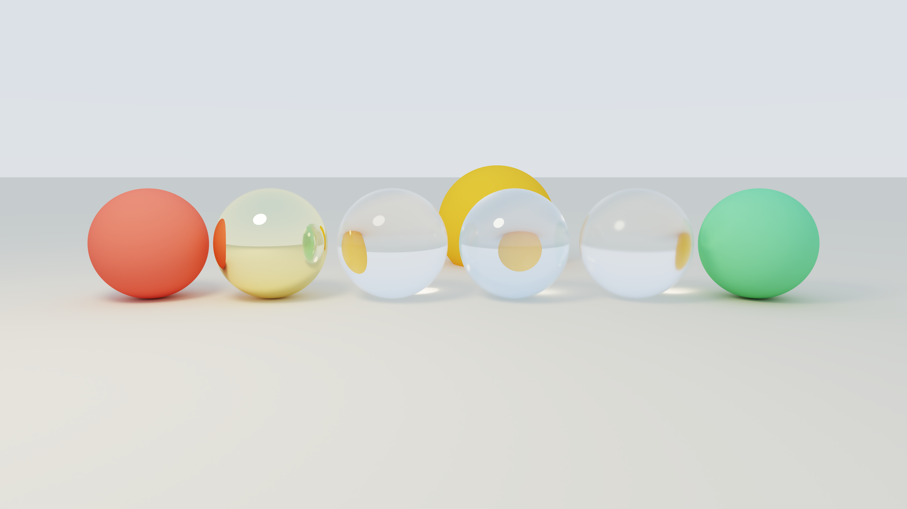

# Wavefront Path Tracer (GPU-accelerated)

## Building

The project is managed using `cmake` in a conventional format.

```sh
# build with CUDA and OptiX support
cmake -B build -DENABLE_CUDA=ON -DENABLE_OPTIX=ON && cmake --build build -j
```

Requires CUDA 12+, OptiX headers (vendored under `vendored/optix/`), and
driver ≥ 555 for the OptiX 8.1.0 ABI.

This will produce the executables `build/path_tracer_cpu` and `build/path_tracer_gpu`.

## Usage

Simply render a scene by passing in a scene description json into the path tracer executables.

```sh
# run cpu path tracer (recursive)
./build/path_tracer_cpu scenes/spheres.json

# run cpu path tracer (wavefront)
./build/path_tracer_cpu --wavefront scenes/spheres.json

# run gpu path tracer (wavefront, CUDA)
./build/path_tracer_gpu scenes/spheres.json

# run gpu path tracer (wavefront, CUDA + OptiX)
./build/path_tracer_gpu --optix scenes/spheres.json

# For both executables, you can override the default scene resolution
# and samples per point using the --width, --height, and --spp flags.
./build/path_tracer_gpu --width 1920 --height 1080 --spp 2048 scenes/spheres.json
```

After performing the path tracing, the output image will be saved to the `outputs/` directory in a subdirectory based on the renderer used (one of `cpu_recursive/`, `cpu_wavefront/`, `gpu_cuda_bvh/`, and `gpu_optix/`).

The path tracing can also be run automatically for multiple scenes using the `benchmark.py` script, collecting performance information as well.

```bash
python benchmark.py [--gpu-only] [--cpu-only] [--scenes a,b,c] \
                    [--gpu-res WxH] [--cpu-res WxH] [--spp N]
```

Furthermore, profiling details were collected using:

```bash
ncu --set detailed --kernel-name "regex:<KERNEL>" --launch-count 2 \
    -o <report>.ncu-rep \
    ./build/path_tracer_gpu scenes/<scene>.json --width 1920 --height 1080 --spp 4

nsys profile -o <report>.nsys-rep \
    ./build/path_tracer_gpu scenes/dragon_glass.json --width 1920 --height 1080 --spp 32
```

## Features

As described in the proposal, I have implemented a path tracer that can render photo-realistic images by simulating the propagation of light in a scene.

This renderer includes all featured mentioned in the proposal, including:
- Shape primitives:
  - Sphere, cylinder, disk, cube, plane, triangle meshes (loaded as `.obj` files)
  - accelerated ray-scene intersection using a Bounded Volume Hierarchy (BVH)
    - inlcudes both a pure CUDA implementation and a OptiX-accelerated implementation
- Materials:
  - Diffuse (matte)
  - Specular (reflective)
  - Dieletric (refractive)
  - Emissive (bright)
- Postprocessing:
  - ACES tonemapping
  - Atrous wavelet filter for denoising

Scenes can then be described using a simple description language in JSON, which allows specifying shapes, materials, camera settings, and other rendering options.
For example, this is the scene description for the "bunny_studio" scene.

```json
{
  "camera": {
    "position": [0.0, 2.5, 6.0],
    "look_at":  [0.0, 1.2, 0.0],
    "up":       [0.0, 1.0, 0.0],
    "vfov_deg": 36.0
  },
  "render": {
    "width":         960,
    "height":        540,
    "spp":           1024,
    "max_depth":     20,
    "rr_min_depth":  3,
    "firefly_clamp": 20.0,
    "background":    [0.04, 0.04, 0.06],
    "output":        "bunny_studio.png",
    "tonemapping":   "aces",
    "denoise": {
      "enabled":       true,
      "sigma_r":       0.06,
      "atrous_passes": 3
    }
  },
  "materials": [
    { "type": "diffuse",          "albedo": [0.70, 0.62, 0.48] },
    { "type": "rough_dielectric", "albedo": [0.97, 0.97, 0.95], "ior": 1.46, "roughness": 0.10 },
    { "type": "emissive",         "albedo": [0.0, 0.0, 0.0], "emission": [14.0, 11.0,  6.0] },
    { "type": "emissive",         "albedo": [0.0, 0.0, 0.0], "emission": [ 4.0,  7.0, 16.0] },
    { "type": "emissive",         "albedo": [0.0, 0.0, 0.0], "emission": [10.0, 11.0, 14.0] }
  ],
  "shapes": [
    { "type": "plane",  "center": [0.0,   0.0, 0.0], "normal": [0, 1, 0], "material": 0 },
    {
      "type":      "mesh",
      "file":      "../models/bunny.obj",
      "material":  1,
      "translate": [0.22, -0.03, -0.11],
      "scale":     1.5,
      "rotate_y":  20.0
    },
    { "type": "sphere", "center": [ 5.0, 6.0,  5.0], "radius": 1.5, "material": 2 },
    { "type": "sphere", "center": [-5.0, 5.0,  3.0], "radius": 1.0, "material": 3 },
    { "type": "sphere", "center": [-1.0, 4.0, -6.0], "radius": 0.8, "material": 4 }
  ],
  "lights": [
    { "type": "area", "shape_id": 1 },
    { "type": "area", "shape_id": 2 },
    { "type": "area", "shape_id": 3 }
  ]
}
```

## Sample Renders

All images rendered at 3840 × 2160 with native scene `spp` (1024 for most
scenes; 2048 for `cornell_box` and `dragon_glass`) on an RTX A5000 via the
OptiX backend.

Note: I only uploaded the `gpu_cuda_bvh` renders to this repository, since the images are very large so Github won't let me make the repo too big.
You can get the other outputs by running the `benchmark.py` as described above.
But basically, all of the outputs should look the same (since they are all implementing the same exact algorithm, just with different performance characteristics).

| Scene | Render |
|---|---|
| `materials` |  |
| `cornell_box` |  |
| `spheres` |  |
| `bunny_studio` |  |
| `bunny_diffuse` |  |
| `dragon_glass` |  |
| `dragon_diffuse` |  |

## Algorithm: wavefront path tracing

A wavefront tracer iterates **bounce-by-bounce across all in-flight rays
at once** instead of completing one path before starting the next. Every
stage of the path (intersect, shade, light sampling) becomes a separate
kernel that works on a queue of rays.

The same loop drives both the CPU wavefront and both GPU backends. The
only difference between the GPU backends is the intersection kernel:
software BVH traversal vs an `optixLaunch` into RT cores.

### Top-level loop

This is the pseudo-code for the overall wavefront path tracing algorithm.
After generating a set of camera rays, we repeatedly intersect them with the scene, shade the hits, and continue with the surviving bounces until no rays remain.

```
function render(scene, image, spp, N_BATCH):
    image  ← 0
    queue  ← allocate(N_BATCH * width * height)        # ray queue, SoA
    hits   ← allocate(N_BATCH * width * height)        # hit queue, SoA
    shadow ← allocate(N_BATCH * width * height)        # shadow candidates (OptiX only)

    for s in 0 .. spp step N_BATCH:                    # outer sample loop
        batch ← min(N_BATCH, spp - s)
        for b in 0 .. batch:
            launch generate_kernel(scene, sample=s+b, queue[b])

        queue.count ← batch * width * height
        while queue.count > 0:                         # bounce loop
            if backend == CUDA_BVH and large_mesh:
                launch compute_ray_keys_kernel(queue)  # sort rays for BVH coherence
                cub::DeviceRadixSort(queue)

            if backend == CUDA_BVH:
                launch intersect_kernel(queue, hits, image)           # miss → image_buf inline
                launch shade_kernel_impl<0>(hits, next_queue, image)  # inline NEE shadow trace
            else:  # OptiX
                optixLaunch(__raygen__primary, queue → hits, image)   # RT-core traversal
                launch shade_kernel_impl<1>(hits, next_queue, shadow) # deferred shadow emit
                optixLaunch(__raygen__shadow, shadow → image)         # any-hit shadow trace

            swap(queue, next_queue)

    launch scale_kernel(image, 1 / spp)
```

## GPU kernel catalogue

Profiles taken with `ncu --set detailed` on an **RTX A5000** (sm_86, 84 SMs,
24 GB GDDR6, 768 GB/s peak), at **1920 × 1080, spp = 4**. *Per-launch*
durations are shown — each kernel is called once per bounce per frame.

### `warp_compact_slot` — warp-aggregated queue compaction

A device helper used by every kernel that writes to an output queue. Rather than one `atomicAdd` per thread, it uses warp ballot to issue a single `atomicAdd` per warp, reducing atomic traffic by up to 32×.

| Metric | Value |
|---|---|
| Used by | All kernels that compact into a queue |
| Atomics per warp | 1 (vs 32 without aggregation) |

```
function warp_compact_slot(d_count, active):
    mask ← ballot_sync(active)                         # 1 bit per active lane
    if not active: return -1
    rank ← popc(mask & ((1 << lane_id) - 1))           # this thread's order within warp
    if rank == 0: base ← atomicAdd(d_count, popc(mask))# one atomic for the whole warp
    base ← shfl_sync(base, ffs(mask) - 1)              # broadcast base to all lanes
    return base + rank
```


### `generate_kernel` — primary ray generation

Generates one camera ray per pixel-sample: computes a jittered camera ray and writes the initial ray-queue slot (origin, dir, throughput, radiance, depth, seed, pixel index).

| Metric | Value |
|---|---|
| Used by | Both backends |
| Achieved occupancy | 85 % |
| SM throughput | 29 % |
| Memory throughput | **95 %** |
| Duration / launch | ~180 µs |

```
for each pixel (x, y) in parallel:
    ray ← camera_ray(x, y, sample_index, seed)
    queue[i] ← { origin, dir, throughput=(1,1,1),
                  radiance=(0,0,0), depth=0, seed, pixel_index }
```

### `intersect_kernel` — software BVH traversal (CUDA BVH backend)

Traverses the SAH BVH for each active ray. Hits are compacted into the `HitQueue`; misses write the background contribution directly to `image_buf`.

| Metric | Value |
|---|---|
| Used by | CUDA BVH backend |
| Achieved occupancy | 40–47 % |
| SM throughput | 40–56 % |
| Memory throughput | 46–80 % |
| Duration / launch | 2–25 µs |

```
for each ray i in queue[0..count) in parallel:
    hit ← bvh_traverse(ray)          # iterative-stack SAH BVH
    if hit:
        j ← warp_compact_slot(d_hit_count)
        hit_queue[j] ← { hit_record, ray_state[i] }
    else:
        bg ← throughput[i] * background(ray.dir)
        atomicAdd(image_buf[pidx], bg)
```

### `shade_kernel_impl<DEFERRED>` — BSDF evaluation, NEE, continuation

Evaluates the BSDF at each hit, performs next-event estimation, applies Russian roulette, and emits continuation rays. The template parameter selects inline NEE (CUDA BVH) or deferred shadow-queue emission (OptiX).

| Metric | `shade<0>` (CUDA) | `shade<1>` (OptiX) |
|---|---|---|
| Achieved occupancy | 37–44 % | 51–54 % |
| SM throughput | 41–55 % | 28–40 % |
| Memory throughput | 52–86 % | 82–92 % |
| Duration / launch | 3–443 µs | 2–436 µs |

```
for each hit i in hit_queue[0..count) in parallel:
    mat ← materials[hit.material_id]

    if mat.emissive:
        if hit.count_emission: image_buf[pidx] += throughput * emission
        continue                           # path terminates

    bsdf ← sample_bsdf(mat, wo, normal, seed)

    if not bsdf.specular:
        if DEFERRED:
            j ← warp_compact_slot(d_shadow_count)
            shadow_queue[j] ← nee_candidate(hit)   # deferred shadow trace
        else:
            if not shadow_blocked(hit):            # inline BVH shadow trace
                image_buf[pidx] += throughput * nee_contrib

    new_tp ← throughput * bsdf.weight
    if depth >= rr_min_depth:
        q ← 1 - max(new_tp)
        if rand() < q: continue             # path terminates (Russian roulette)
        new_tp /= (1 - q)

    k ← warp_compact_slot(d_next_count)
    next_queue[k] ← { scatter_ray, new_tp, depth+1, ... }
```

### `compute_ray_keys_kernel` + CUB radix sort (CUDA BVH, mesh ≥ 50 K only)

Assigns a 32-bit sort key to each ray (direction octant + Morton-coded origin), then sorts the ray queue so adjacent threads traverse the same BVH region, improving L2 reuse in the subsequent `intersect_kernel`.

| Metric | Value |
|---|---|
| Used by | CUDA BVH backend, large-mesh scenes only |
| Achieved occupancy | 91 % |
| SM throughput | 19 % |
| Memory throughput | **96 %** |
| Duration / launch (keys) | 330–360 µs |

```
for each ray i in queue[0..count) in parallel:
    octant  ← sign_bits(ray.dir)             # 3 bits
    morton  ← morton_encode(quantise(ray.origin))   # 29 bits
    keys[i] ← (octant << 29) | morton

cub::DeviceRadixSort::SortPairs(keys, queue, count)
```

### `scale_kernel` — final 1/spp scaling

Divides each accumulated HDR pixel by `spp` to produce the final average. One multiply per channel; run once at the end of the frame.

| Metric | Value |
|---|---|
| Used by | Both backends |
| Achieved occupancy | 79 % |
| Memory throughput | 88 % |
| Duration / launch | ~71 µs |

```
for each pixel-channel c in image_buf in parallel:
    image_buf[c] *= 1.0 / spp
```

### OptiX device programs (OptiX backend only)

These run inside `optixLaunch` and do not appear as separate kernels in `ncu`.
The OptiX kernels accelerate ray-mesh intersections using the hardware RT cores on the RTX A5000.

| Program | Purpose |
|---|---|
| `__raygen__primary` | Loads ray from `RayQueue`, fires `optixTrace` into the scene GAS. |
| `__miss__primary` | Writes `throughput × background` directly to `image_buf` (no miss-queue needed). |
| `__closesthit__triangle` | Resolves hit normals and material, warp-compacts into `HitQueue`. |
| `__raygen__shadow` | Loads from `ShadowQueue`, fires `optixTrace` with `TERMINATE_ON_FIRST_HIT`. |
| `__miss__shadow` | Unblocked shadow ray — `atomicAdd`s the pre-scaled NEE contribution into `image_buf`. |

## Performance analysis: comparison of all renderers

All measurements were taken on a single server:

- **CPU**: Intel Xeon E5-2640 v3 (8 cores / 16 threads, 2.6 GHz). 20 MB
  L3 cache. Theoretical DRAM bandwidth ~40 GB/s (DDR4-1600 quad-channel).
- **GPU**: NVIDIA RTX A5000 (sm_86, 84 SMs × 128 CUDA cores, 24 GB
  GDDR6, **768 GB/s** peak memory bandwidth, 40 MB L2).

The renderers use the same scene loader, BSDFs, NEE logic, and image
output; only the integrator structure and execution platform differ. The
table below uses **Mrays/s** — primary rays per second, normalised over
`spp × W × H` — because it is independent of the resolution/spp choice
and lets us compare scenes with different sampling budgets directly.


| Scene | Mesh | CPU Recursive | CPU Wavefront | GPU CUDA BVH | GPU OptiX | CUDA / WF | OptiX / CUDA |
|---|---:|---:|---:|---:|---:|---:|---:|
| `spheres` | 0 | 10.9 | 7.3 | 833 | 521 | **114 ×** | 0.63 × |
| `cornell_box` † | 0 | 3.0 | 1.9 | 200 | 138 | **105 ×** | 0.69 × |
| `materials` | 0 | 15.7 | 8.1 | 966 | 670 | **119 ×** | 0.69 × |
| `mesh_test` | 12 | 13.2 | 6.5 | 795 | 480 | **122 ×** | 0.60 × |
| `bunny_studio` | 144 K | 3.1 | 1.8 | 149 | 463 | **83 ×** | **3.1 ×** |
| `dragon_glass` | 871 K | 1.5 | 1.0 | 64 | 274 | **64 ×** | **4.3 ×** |
| `bunny_diffuse` | 144 K | 5.3 | 2.8 | 224 | 603 | **80 ×** | **2.7 ×** |
| `dragon_diffuse` | 871 K | 3.5 | 1.9 | 141 | 479 | **74 ×** | **3.4 ×** |

Settings: CPU runs at **1280 × 720, spp = 128**; GPU runs at
**3840 × 2160, native scene spp** (1024 for most; 2048 for `cornell_box`
and `dragon_glass`).

A few quick observations from the table:

- The **CPU wavefront is 1.5–2× slower than recursive on CPU** — the
  same wavefront overhead that the GPU hides almost for free.
- **GPU CUDA BVH is 64–122× faster than the CPU wavefront** on the same
  algorithm. The smaller the mesh (or, equivalently, the better the BVH
  fits in cache), the higher the speedup — analytic scenes hit the
  100–120× range; the 871 K-triangle dragon drops to 64×.
- **OptiX is slower than CUDA BVH on small scenes** (0.60–0.69×) and
  much faster on large meshes (up to 4.3× on `dragon_glass`).

Four trends in detail, in order of importance:

#### 1. The wavefront tracer is fundamentally a memory-bandwidth machine.

On every kernel where we have steady-state data (`generate`,
`compute_ray_keys`, the shadow-side of `shade`, the miss-write side of
`intersect`), measured **memory throughput sits between 86 % and 96 %**
of the A5000's 768 GB/s peak. The SM-throughput numbers are 20–55 %,
meaning the math unit is mostly waiting for data. This dictates almost
all of the optimisation lessons: anything that reduces total bytes moved
buys throughput, anything that just reduces math does not.

#### 2. The CUDA software BVH is the only thing slow enough to be compute-limited on big meshes.

`intersect_kernel`'s per-launch time on `dragon_glass` (871 K tris) is
~11× larger than on `cornell_box` (0 tris), and it dominates the entire
frame (88.5 % of CUDA-side GPU work). The BVH node array (~35 MB)
exceeds the L2's effective hit rate once secondary rays scatter, and the
software traversal does **random-access loads** of node and triangle
data that don't coalesce well across a warp. This is why the *OptiX*
backend, which traverses the same geometry in RT-core fixed-function
hardware, achieves up to **4.3× higher overall throughput** despite the
shading half of the pipeline being roughly equal in cost.

The CPU wavefront pays a related-but-different price on the same scene:
its 871 K-tri BVH traversal blows past the 20 MB L3 entirely, forcing
DRAM refills that the GPU at least serves from a 40 MB L2. That's why
the CPU wavefront on `dragon_glass` is *only* 64× slower than the GPU
CUDA BVH on the same algorithm, vs ~120× slower on analytic-only scenes
— the GPU's effective advantage shrinks once the working set escapes
its cache too.

#### 3. RT cores trade per-bounce intersect for per-bounce launch overhead.

OptiX is **slower on analytic-only scenes** (0.60–0.69 × CUDA BVH on
`spheres`/`materials`/`mesh_test`/`cornell_box`) for two reasons.
First, all analytic shapes are tessellated into triangle meshes before
the AS build (sphere → 112 tris, cylinder → 32, disk → 16), so the GAS
is a deeper hierarchy than the software BVH would build over a handful
of raw primitives. Second, every bounce now pays two `optixLaunch` API
calls (primary + shadow) plus their queue-count `cudaMemcpy` readbacks —
~75 ms across a full `dragon_glass` render at 1080p / spp 32 just for
the count copies. On scenes where intersect is already cheap (no large
mesh), this overhead exceeds the RT-core win.

The crossover is sharp: 12 triangles (`mesh_test`) and OptiX is still
40 % slower, but 144 K triangles (`bunny_studio`) and OptiX is 3.1×
faster. Once the mesh is large enough that *any* node array exceeds the
L2's effective working-set capacity, RT cores win convincingly.

#### 4. The CPU wavefront is intentionally slow.

Recursive is **1.5–2× faster than wavefront on CPU**. The wavefront
adds per-bounce queue writes, queue reads, and a 23-call `compact_field`
memmove pass for SoA compaction — overhead that the recursive renderer
avoids by keeping path state on the call stack. On the GPU, warp-ballot
compaction is a handful of instructions and asynchrony hides global-memory
latency for free across thousands of concurrent warps. **The wavefront
architecture is designed for GPU execution**; its CPU port exists for
algorithmic-parity validation, not as a performance target.

### Relating throughput to memory bandwidth

A back-of-envelope upper bound: assume a single bounce reads/writes
roughly 100 B of ray state plus the geometry it touches. With 768 GB/s
and an average ~5 bounces per primary ray, the *bandwidth-only* upper
bound is roughly `768e9 / (5 × 100 + geometry_bytes_per_ray)` Mrays/s.
For analytic-only scenes (`geometry_bytes_per_ray` ≈ 0 because the BVH
fits in cache), that's roughly **1 500 Mrays/s** — we hit 833–966 in the
best case (`spheres`, `materials`), 55–63 % of the bandwidth ceiling.

For the dragon scenes the bandwidth ceiling drops sharply because each
ray's BVH walk touches many distinct nodes that don't all stay in L2.
The fact that OptiX achieves 274 Mrays/s on `dragon_glass` — where the
CUDA BVH version manages only 64 — shows that *the same memory* can be
accessed much more efficiently when the traversal is fixed-function
hardware that fetches in well-known coherent patterns, even when the
software-side memory pressure looks identical.

## Potential improvements

Feature-wise, this is still quite a minimal path tracer. We have a few
primitive shapes, generic triangle meshes, and some basic materials. I think
the real interesting part of path tracers come from being able to generate
really photorealistic renderings of interesting physical phenomenon like
subsurface scattering, volume scattering (through a gas or fluid), chromatic
aberration, etc. So implementing these more advanced rendering techniques would
be really cool.

I also think more optimizations are possible. The current CUDA BVH traversal
logic is pretty naive, consisting of an optional sorting kernel followed by a
stack-based tree traversal. On large meshes, the OptiX hardware tracing
performs 2-4 times better than the raw CUDA approach. However, the raw CUDA
approach performs much better when most objects in the scene are analytical
objects, as it reduces a lot of overhead in terms of tree traversals, even if
they are hardware-accelerated. I tried using the OptiX API for primitive
shapes, but I couldn't get it working for some reason, so I was forced to have
a hard split between the pure CUDA implementation (supports both analytical
shapes and meshes) and the OptiX implementation (all shapes tessellated, meshes
only). This is probably something I could fix or come up with a better solution
for, given more time and effort.

Most of the kernels are memory-bound which is good in the sense that I'm using
the GPU to its full extent, but bad in that I'm hitting a fundamental limit in
how many rays can be transferred in/out of memory for every iteration of the
wavefront path tracing algorithm. I think there are some more advanced CUDA
techniques that could allow me to keep the queues on-chip for multiple
iterations, reducing bandwidth and squeezing more compute performance out of
the kernels. And I'm sure there's plenty of tricks, like sorting the BVH tree
(which I already do, naively) or performing other sorts of software preparation
that can make the GPU kernels perform better.
